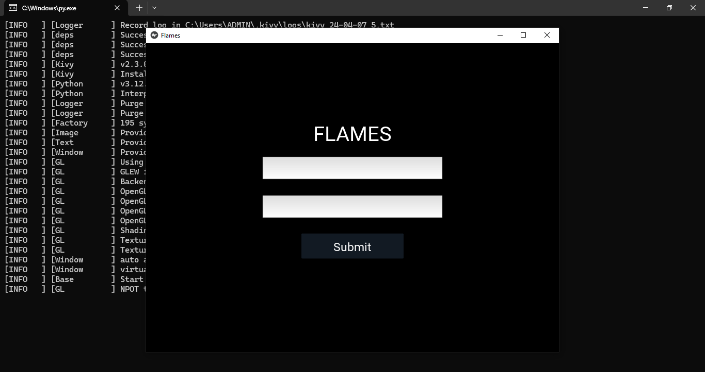
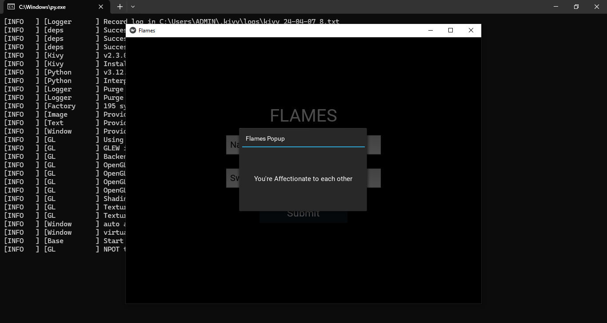

# Flames Relationship Calculator: A Playful Python Desktop App
## Description:
The Flames Relationship Calculator is a Python desktop application developed using the Kivy framework. It determines the relationship status between two people by processing their names through the traditional "FLAMES" method.

### Key Features:

- Simple interface: Offers a straightforward interface for inputting two names and receiving instant results.
- FLAMES algorithm: Utilizes the traditional FLAMES methodology to generate relationship outcomes, adding a touch of fun to the experience.

### Sample pictures

#### Packages used
- kivy